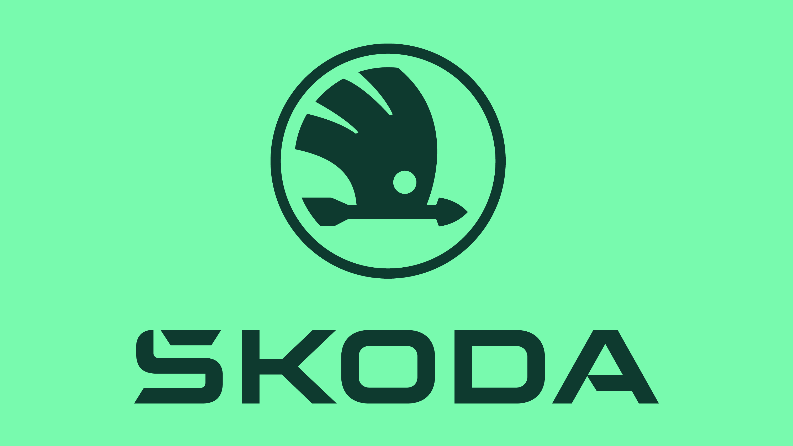
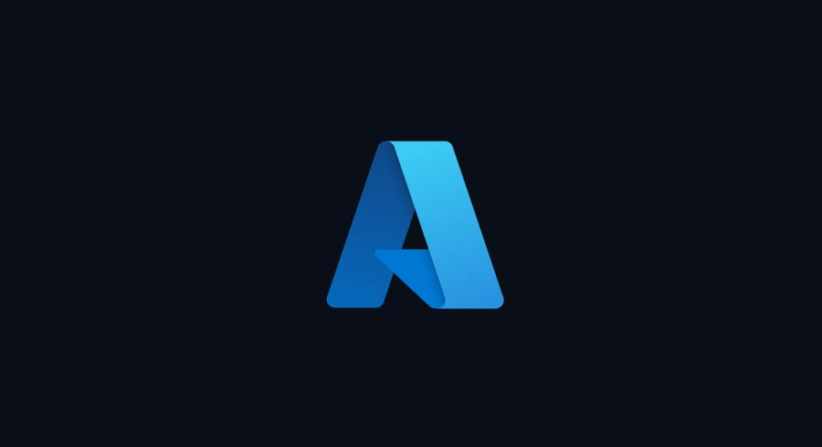
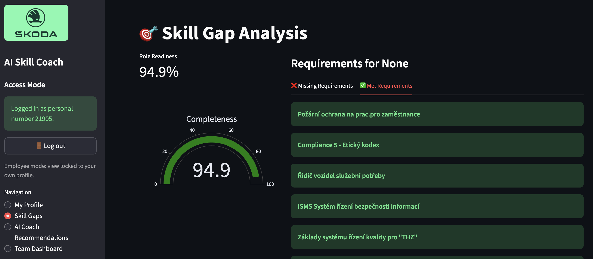

<div align="center">
  
  
</div>

<br>

<div align="center">

[](https://github.com)
[](https://python.org)
[](https://streamlit.io)
[](https://azure.microsoft.com)

</div>

---

# 🤖 AI Skill Coach — Škoda Auto & 42Prague Hackathon

> **"With love to Škoda"** — Built in 48 hours at AFI Tower, Prague · November 20–21, 2025

AI Skill Coach is a fully working intelligent talent development assistant built by our team during the **Škoda Auto × 42Prague Hackathon**. The app connects employee skill data with job requirements and career goals — and uses **Azure OpenAI GPT-4.1** to generate a personalized, step-by-step learning plan for each employee.

---

## 🏆 The Challenge

Škoda Auto's HR & Learning team set a clear problem: the company wants to become a **skill-based organization**, but employees currently have no clear visibility into:

- What skills they are missing for their next role
- Which internal Škoda Academy courses would close those gaps
- Where they stand compared to the requirements of their planned position

The hackathon challenge was to build a working prototype of an **AI Skill Coach** that could:

| Goal | Description |
|------|-------------|
| 📊 Skill Gap Analysis | Compare an employee's current skills against role requirements |
| 🎓 Personalized Learning Paths | Suggest specific courses from the Degreed catalog |
| 👔 Manager Dashboard | Give managers a birds-eye view of team skill coverage |
| 🤖 AI-Powered Recommendations | Use LLMs to create motivating, actionable development plans |

Evaluation was scored across 6 criteria: **AI/Data usage · Solution efficiency · Creativity · Data security · Presentation · Technical quality** — maximum 5.0 weighted score.

---

## ✅ What We Delivered

A fully operational **Streamlit web app** — ready to run locally — that plugs directly into Škoda's real HR data exports (ERP, Degreed, org hierarchy) and delivers four core experiences:

### 👤 My Profile Page
Every employee gets a complete snapshot of their professional identity:
- Current and planned profession / position
- Education profile (branch, category, field of study)
- ERP classification (OB1 / OB2 / OB3 / OB5 / OB8)
- Full skill overview with category bar chart
- Complete Degreed learning history with dates, providers and content types

### 🎯 Skill Gap Analysis
A live gap dashboard that shows:
- **Role Readiness %** — a gauge chart showing how complete the employee's qualification profile is
- **Missing Requirements** — mandatory vs. optional qualifications not yet met, highlighted in red/yellow
- **Met Requirements** — everything already checked off, shown in green

### 🤖 AI Coach Recommendations
The flagship feature: one click generates a personalized growth plan powered by **Azure OpenAI GPT-4.1**:
- Analyzes the employee's skill gaps
- Matches relevant courses from the internal Degreed content catalog
- Outputs a structured 3-phase learning plan (Foundations → Application → Mastery)
- Includes direct deep-links to Škoda's own LMS courses
- Downloadable as a Markdown file

### 👥 Team Dashboard (Manager Mode)
Managers can switch freely between employees and get:
- Total headcount and number of unique positions in the team
- Roles distribution bar chart (top 15 positions)
- Full drill-down into any individual employee's profile and gaps

---

## 🏗️ Architecture

```
app.py                  ← Streamlit UI + routing
srcs/
  data_loader.py        ← Loads & normalizes 8+ heterogeneous HR Excel exports
  processing.py         ← Skill gap engine, profile builder, team stats
  ai_service.py         ← Azure OpenAI integration + course matching + prompt engineering
data/                   ← HR datasets go here (not committed — confidential)
imgs/                   ← Branding assets
```

**Data sources handled:**
- `ERP_SK1` — employee master data (profession, position, education, OB classification)
- `Degreed.xlsx` — individual learning completions
- `Degreed_Content_Catalog.xlsx` — full internal course library with URLs
- `Skill_mapping.xlsx` — course → skill mapping (two-sheet bundle)
- `ZHRPD_VZD_STA_016` — employee qualifications
- `ZPE_KOM_KVAL.xlsx` — position qualification requirements
- `RLS.sa_org_hierarchy` — organizational structure

The `DataLoader` normalizes all column names to `snake_case` ASCII and resolves ~60+ column alias variants across CZ/EN data exports — so the app works regardless of which language or ERP version the data comes from.

---

## 🛠️ Tech Stack

| Layer | Technology |
|-------|-----------|
| UI | Streamlit |
| Data processing | pandas, numpy, scikit-learn |
| Visualization | Plotly |
| AI backend | Azure OpenAI — GPT-4.1 (`hackathon-gpt-4.1`) |
| Data formats | Excel (.xlsx), CSV |
| Language | Python 3.13 |

---

## 🖼️ Screenshots

<div align="center">
  
</div>

---

## 🚀 Running the App

### 1. Clone and set up the environment

```bash
git clone <this-repo>
cd ai-skill-coach
python3 -m venv venv
source venv/bin/activate
pip install -r requirements.txt
```

### 2. Add the HR datasets to `data/`

```
data/
  Degreed_Content_Catalog.xlsx
  Degreed.xlsx
  ERP_SK1.Start_month - SE.xlsx
  RLS.sa_org_hierarchy - SE.xlsx
  Skill_mapping.xlsx
  ZHRPD_VZD_STA_007.xlsx
  ZHRPD_VZD_STA_016_RE_RHRHAZ00.xlsx
  ZPE_KOM_KVAL.xlsx
```

### 3. Configure Azure OpenAI credentials in `.env`

```env
AZURE_OPENAI_API_KEY=your_api_key_here
AZURE_OPENAI_ENDPOINT=https://your-resource.openai.azure.com/
AZURE_OPENAI_DEPLOYMENT_NAME=hackathon-gpt-4.1
AZURE_OPENAI_API_VERSION=2025-01-01-preview
```

### 4. Launch

```bash
streamlit run app.py
```

Open `http://localhost:8501` — choose **Employee** or **Manager** mode and go.

---

## 👥 Dream Team

| | Name |
|---|------|
| 🧑‍💻 | **Denys Kot** |
| 🧑‍💻 | **Mark Sylaiev** |
| 🧑‍💻 | **Dmitri Curdoglo** |

Built with love at **AFI Tower, Praha** during the Škoda Auto & 42Prague Hackathon — November 20–21, 2025.

---

## 💡 Key Design Decisions

- **No hallucinated links** — the AI prompt strictly constrains the model to use only courses provided from the real Degreed catalog. No made-up URLs.
- **Dual-role access control** — employees are locked to their own profile; managers can freely browse all employees.
- **Graceful degradation** — if Azure credentials are missing or the API fails, the app falls back to a structured mock plan so the UI always works.
- **Language-agnostic data layer** — the `DataLoader` handles Czech/English column name variants across all Škoda ERP exports without manual preprocessing.
- **Security** — all data stays local. Azure OpenAI was chosen as the AI backend to keep employee data within the enterprise perimeter.

---

<div align="center">

*Škoda Auto × 42Prague Hackathon 2025 — Skill Growth Challenge*

</div>
